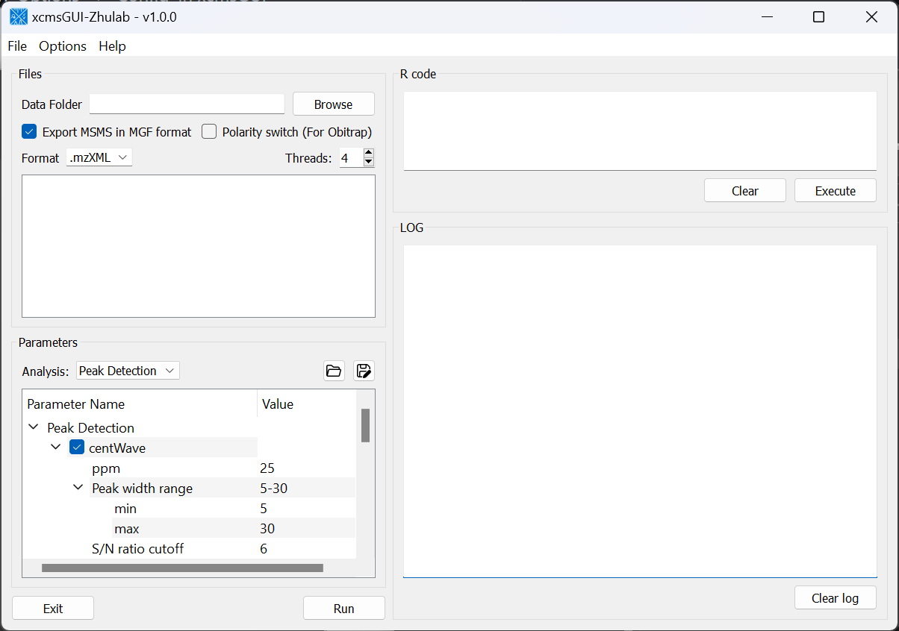
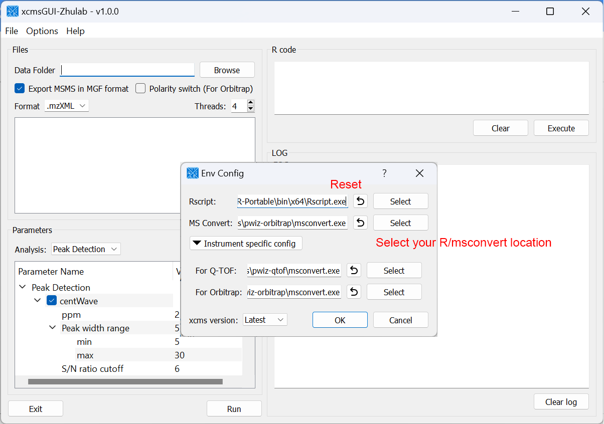
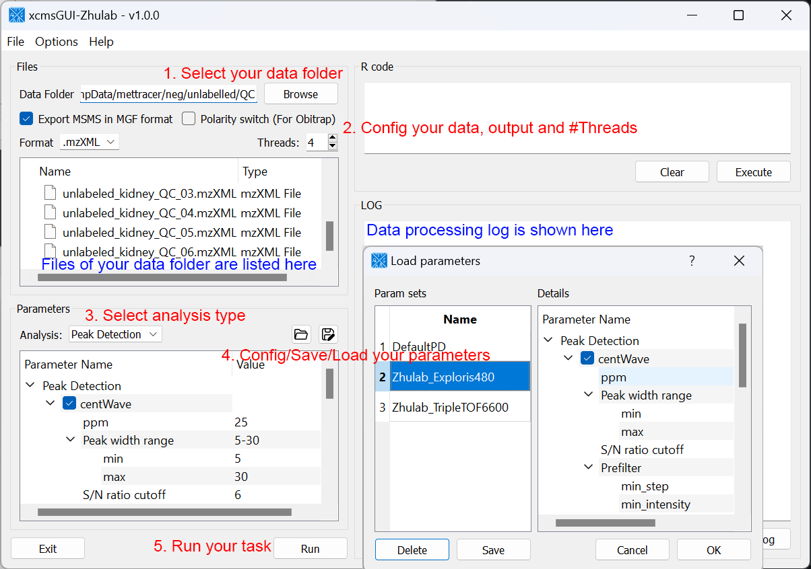
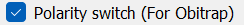
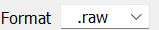
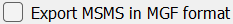
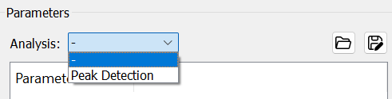
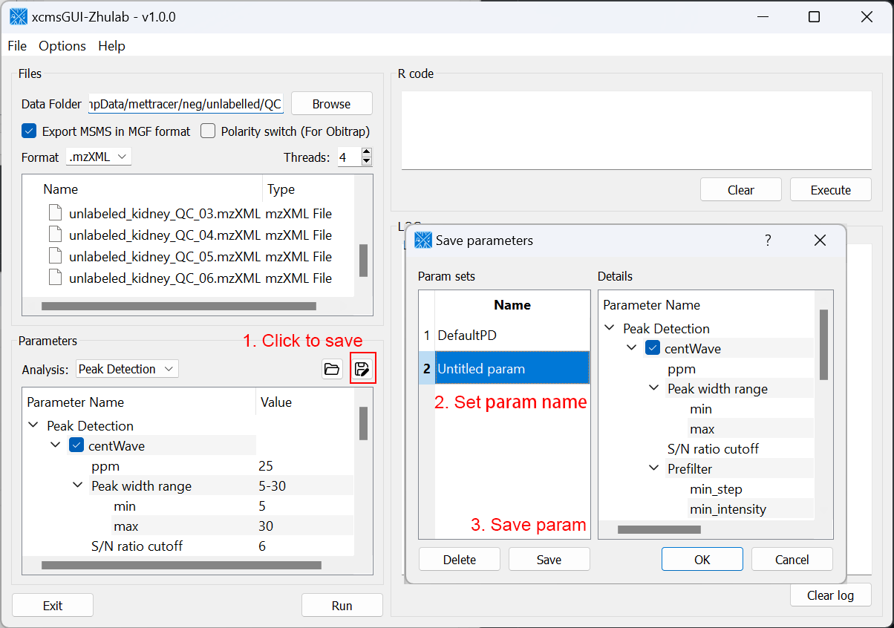
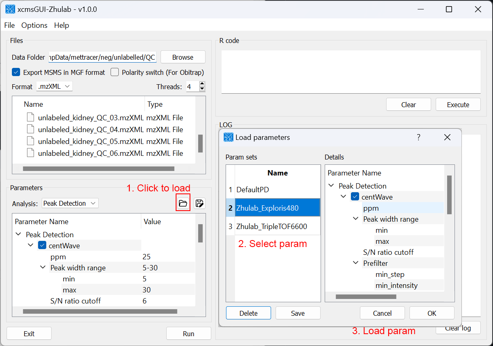

# Introduction

For users' convenience, we developed an all-in-one GUI tool, namely, `xcmsGUI-Zhulab`, to integrate data conversion (using `MSConvert` in `ProteoWizard`) and data pre-processing (using `XCMS`) in one analysis. Users only need input raw MS data files (`.d`, `.raw`, or `.wiff`) from vendor instruments to `xcmsGUI`. Then, `xcmsGUI` enables to perform data conversion and peak detection altogether in one step. Finally, a peak table and MS/MS spectra files (`MGF` format) are generated as the input files for [`MetDNA`](http://metdna.zhulab.cn). Sample information file is generated automatically for [`MetDNA`](http://metdna.zhulab.cn).

# Download

- [All in one](https://github.com/ZhuMetLab/xcmsGUI/releases/download/v1.0.0/xcmsGUI.zip) contains
	- `xcmsGUI-Zhulab`
	- `R-portable`
	- `PreteoWizard`

# Config

- To use [All in one](https://github.com/ZhuMetLab/xcmsGUI/releases/download/v1.0.0/xcmsGUI.zip) software, one can just run the xcmsGUI.exe after unzip `xcmsGUI-Zhulab-all.zip`

# Peak detection

***Note***
1. We support polarity switch mode of ThermoFisher Obitrap instruments (e.g., Exploris 480). Users should just check `Ploarity swith (For Obitrap)`  and set data format to `.raw`
2. For MS1 only data, users should uncheck `Export MSMS in MGF Format`
3. If only MSMS spectra needed, users should just select `-` in `Analysis` and `Run` the program.

# Saving peak detection parameters for next time

# Load previous saved parameters

# License

This work is licensed under the Attribution-NonCommercial-NoDerivatives 4.0 International (CC BY-NC-ND 4.0)