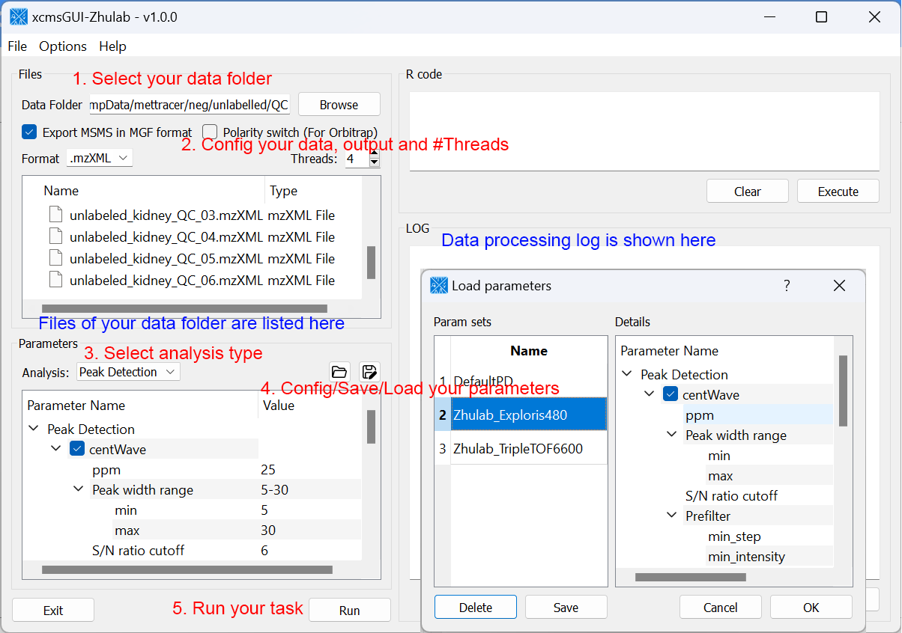
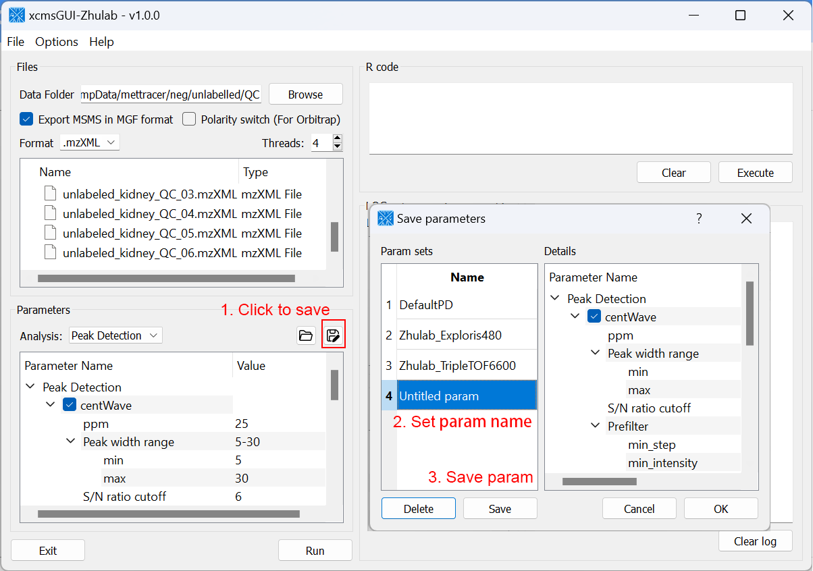
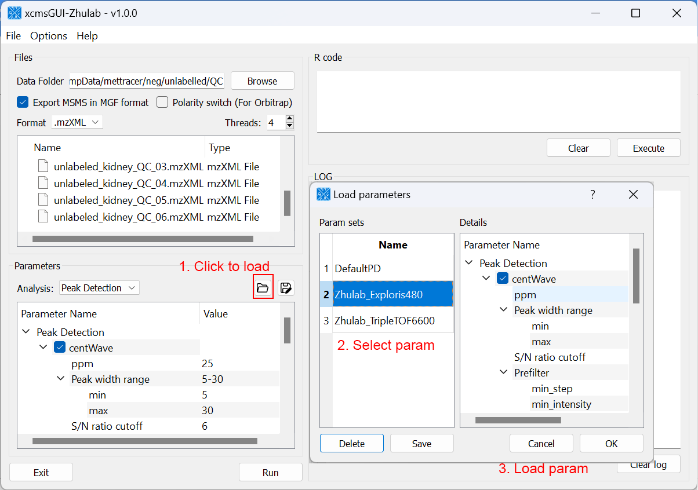

# Introduction

`xcmsGUI-Zhulab` is a GUI tool to detect MS peaks with `xcms` `R` package. It can detect MS peaks with XCMS using mzXML data and export MSMS spectra to `MGF` format. Users can also use vender data generated by MS instrument directly. `xcmsGUI-Zhulab` will detect MS peaks after converting the data to `mzXML` files with `MSConvert` in `ProteoWizard` and export MSMS spectra to MGF format.

# Download

- [All in one](./xcmsGUI.zip) contains
	- `xcmsGUI-Zhulab`
	- `R-portable`
	- `PreteoWizard`
- [Stand-alone](./xcmsGUI-standalone.zip) contains
	- `xcmsGUI-Zhulab` only 

If one have already installed R with xcms and PreteoWizard, [stand-alone](./xcmsGUI-standalone.zip) version is recommanded.

# Config

- To use [All in one](./xcmsGUI.zip) software, one can just run the xcmsGUI.exe after unzip `xcmsGUI-Zhulab-all.zip`
- To use [Stand-alone](./xcmsGUI-standalone.zip) software, one should have
	- R and ProeoWizard installed on Windows OS
	- `xcms` package installed in R
	- [`xcmsTools`](./xcmsTools_0.1.0.tar.gz) package installed in R
	-  config their own R/MSConvert envirenment with 'Options' -> 'Config' in xcmsGUI

# Peak detection

# Saving peak detection parameters for next time

# Load previous saved parameters

